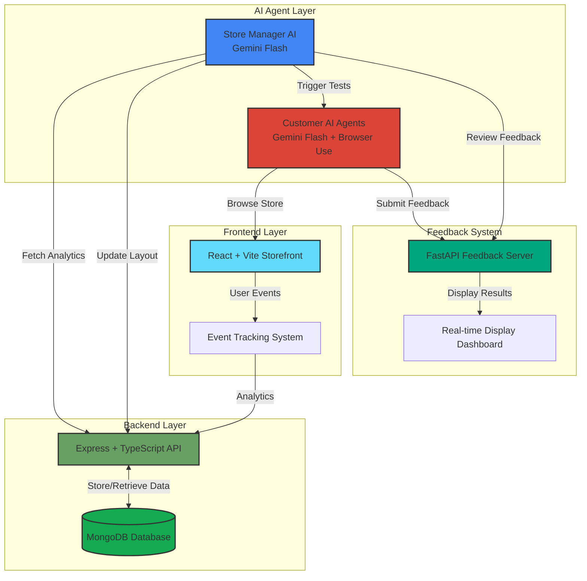

<div align="center">

# 🛑 HALT

### AI-Powered A/B Testing & Store Optimization Platform

[](https://devpost.com/software/halt-y8jwon?ref_content=user-portfolio&ref_feature=in_progress)
[](https://www.halt-hack.tech/)
[](https://uofthacks-13.devpost.com/)

**Transforming E-Commerce Optimization with Autonomous AI Agents**

[Try Live Demo](https://www.halt-hack.tech/) • [View on Devpost](https://devpost.com/software/halt-y8jwon) • [Report Bug](https://github.com/leungt30/HALT/issues)

</div>

---

## 📖 Table of Contents

- [Overview](#-overview)
- [Inspiration](#-inspiration)
- [Features](#-features)
- [Architecture](#-architecture)
- [Tech Stack](#-tech-stack)
- [Getting Started](#-getting-started)
  - [Prerequisites](#prerequisites)
  - [Installation](#installation)
  - [Running Locally](#running-locally)
- [How It Works](#-how-it-works)
- [Challenges](#-challenges)
- [Accomplishments](#-accomplishments)
- [What We Learned](#-what-we-learned)
- [Future Roadmap](#-future-roadmap)
- [Team](#-team)
- [License](#-license)

---

## 🎯 Overview

**HALT** is an innovative AI-powered platform that revolutionizes e-commerce A/B testing by creating realistic customer simulations. Instead of waiting weeks for real user data, businesses can now test store layouts and optimizations in minutes using autonomous AI agents that mimic diverse customer behaviors and preferences.

🔗 **[View Full Project on Devpost](https://devpost.com/software/halt-y8jwon?ref_content=user-portfolio&ref_feature=in_progress)**

---

## 💡 Inspiration

Companies spend **$1.5 billion annually** on A/B testing in the United States alone. Industry leaders like Shopify and Amplitude constantly optimize e-commerce platforms, knowing that even a **0.1% boost in engagement** can generate hundreds of thousands of dollars in additional revenue.

Our team aims to revolutionize this process by leveraging AI to:
- **Accelerate testing cycles** from weeks to hours
- **Reduce costs** associated with traditional A/B testing
- **Enable data-driven decisions** before production deployment
- **Simulate diverse customer personas** with realistic behaviors

---

## ✨ Features

### 🤖 Autonomous AI Agents
- **Store Manager Agent**: Analyzes analytics and optimizes store layouts automatically
- **Customer Agents**: Simulate realistic shoppers with diverse personalities, goals, and behaviors
- **10 Unique Personas**: From budget-conscious browsers to tech-savvy comparison shoppers

### 📊 Real-Time Analytics
- Track customer interactions, browsing patterns, and purchase behaviors
- MongoDB integration for comprehensive event logging
- Visual feedback dashboard for store optimization results

### 🎨 Dynamic Store Layouts
- AI-powered category organization
- Responsive React-based storefront
- Real-time layout updates based on customer feedback

### 🔄 Continuous Optimization Loop
- Store Manager reviews analytics → proposes layout changes
- Customer agents test new layout → provide detailed feedback
- System iterates automatically to find optimal configurations

---

## 🏗️ Architecture



### System Components

| Component | Technology | Purpose |
|-----------|-----------|---------|
| **Frontend** | React + TypeScript + Vite | Customer-facing e-commerce storefront with event tracking |
| **Backend** | Express + TypeScript + MongoDB | RESTful API for layout management and analytics storage |
| **Store Manager AI** | Python + Gemini Flash | Autonomous agent that optimizes store layouts based on data |
| **Customer AI Agent** | Python + Gemini Flash + Browser Use | Simulates diverse customer behaviors and provides feedback |

---

## 🛠️ Tech Stack

### Frontend


### Backend


### AI Agents


### Deployment


---

## 🚀 Getting Started

### Prerequisites

Before running HALT locally, ensure you have:

- **Node.js** (v18 or higher) and **npm**
- **Python** (3.9 or higher)
- **MongoDB** instance (local or cloud)
- **Google Gemini API key** ([Get one here](https://ai.google.dev/))
- **Playwright** browsers installed

### Installation

1. **Clone the repository**
   ```bash
   git clone https://github.com/leungt30/HALT.git
   cd HALT
   ```

2. **Set up Python virtual environment**
   ```bash
   python -m venv .venv
   source .venv/bin/activate  # On Windows: .venv\Scripts\activate
   pip install -r requirements.txt
   ```

3. **Install Playwright browsers**
   ```bash
   playwright install
   ```

4. **Install frontend dependencies**
   ```bash
   cd frontend
   npm install
   cd ..
   ```

5. **Install backend dependencies**
   ```bash
   cd backend
   npm install
   cd ..
   ```

6. **Configure environment variables**

   Create `.env` files in the following directories:

   **`backend/.env`**
   ```env
   MONGODB_URI=your_mongodb_connection_string
   PORT=3000
   ```

   **`store-manager-ai/.env`**
   ```env
   GEMINI_API_KEY=your_gemini_api_key
   BACKEND_URL=http://localhost:3000
   FRONTEND_URL=http://localhost:5173
   ```

   **`customer-ai-agent/.env`**
   ```env
   GEMINI_API_KEY=your_gemini_api_key
   FRONTEND_URL=http://localhost:5173
   ```

---

## 🖥️ Running Locally

HALT consists of **4 independent services** that work together. You can run them individually or use the optimization loop script.

### Option 1: Run All Services Individually

#### 1️⃣ Start the Backend API
```bash
cd backend
npm run dev
```
- Runs on: `http://localhost:3000`
- Provides: RESTful API for layout management and analytics

#### 2️⃣ Start the Frontend Storefront
```bash
cd frontend
npm run dev
```
- Runs on: `http://localhost:5173`
- Provides: Customer-facing e-commerce interface

#### 3️⃣ Start the Customer AI Agent Service
```bash
cd customer-ai-agent
source ../.venv/bin/activate
uvicorn server:app --host 0.0.0.0 --port 8000
```
- Runs on: `http://localhost:8000`
- Provides: API endpoint to spawn customer simulations

#### 4️⃣ Run the Store Manager AI
```bash
cd store-manager-ai
source ../.venv/bin/activate
python agent.py
```
- Autonomous agent that:
  - Fetches analytics from backend
  - Proposes layout optimizations
  - Triggers customer simulations
  - Reviews feedback and iterates

### Option 2: Run Optimization Loop (Automated)

For a complete demonstration, use the included orchestration script:

```bash
chmod +x run_optimization_loop.sh
./run_optimization_loop.sh
```

This script will:
1. ✅ Start the Feedback Display Server (`http://localhost:8001`)
2. ✅ Open a Chrome window showing real-time feedback
3. ✅ Launch the Customer AI Agent Service
4. ✅ Start the Store Manager AI optimization loop

> **Note**: The script uses Vercel production endpoints for frontend/backend by default. To use local instances, modify the environment variables in the script.

---

## 🔄 How It Works

### The Optimization Cycle

1. **Store Manager Analyzes**
   - Fetches customer event data from MongoDB
   - Reviews metrics like bounce rates, category engagement, scroll depth
   - Identifies optimization opportunities

2. **Layout Proposal**
   - AI generates a new store layout hypothesis
   - Reorganizes categories, products, and promotional content
   - Updates layout via backend API

3. **Customer Simulation**
   - Spawns 10 AI customer agents with diverse personas
   - Each agent navigates the store with specific goals:
     - Quick purchase vs. browsing
     - Budget-conscious vs. feature-focused
     - Tech-savvy vs. low technical skill
   - Agents use Browser Use to interact naturally with the UI

4. **Feedback Collection**
   - Each customer agent provides structured feedback:
     - Shopping experience rating
     - Ease of finding products
     - Layout intuitiveness
     - Visual appeal
   - Feedback aggregated and displayed in real-time

5. **Iteration**
   - Store Manager reviews feedback
   - Proposes refined layout based on insights
   - Cycle repeats until optimal performance achieved

---

## 🚧 Challenges

One of our main challenges was creating a **reliable workflow** between multiple autonomous agents and establishing robust data flows throughout the system. 

Key difficulties:
- **Agentic Architecture**: With multiple autonomous agents making decisions based on user behavior, determining how events should be collected, stored, and retrieved required careful design
- **Meaningful Data Collection**: Ensuring the storefront tracked metrics that were actionable for the Store Manager LLM
- **LLM Integration**: Our lack of prior experience with agentic architecture led to many early iterations where the manager lacked sufficient data for meaningful changes
- **System Synchronization**: Coordinating the Store Manager calling the backend → triggering customer agents → agents browsing the site → events generated → feedback collected → manager reviews

Integrating LLMs with decision-making into a traditional web stack required **significant experimentation and exploration**, ultimately making us stronger engineers.

---

## 🏆 Accomplishments

We're proud of:

✅ **Successfully integrating agentic LLMs** into a live web environment, demonstrating their potential beyond traditional chatbot interfaces

✅ **Designing and deploying a robust full-stack pipeline** with clear data flows between 4 independent services

✅ **Creating realistic customer simulations** with 10 diverse personas that accurately mimic human shopping behaviors

✅ **Delivering real-world impact** potential for e-commerce operations and user shopping experiences

---

## 📚 What We Learned

We gained deeper insights into:

- **System Design**: The importance of planning interactions between autonomous components before implementation
- **Agentic Workflows**: Managing complex state machines where agents operate independently yet collaboratively
- **Data Flow Architecture**: Designing event systems that capture meaningful, actionable insights
- **LLM Prompt Engineering**: Crafting effective prompts for autonomous decision-making vs. conversational AI
- **Iterative Development**: Embracing design overhauls as learning opportunities rather than setbacks

A large portion of our time was spent planning how our system would interact with itself—these discussions led to invaluable lessons about distributed AI systems.

---

## 🔮 Future Roadmap

Planned enhancements include:

### Phase 1: Enhanced Personalization
- [ ] **Recommendation System**: Offer complementary goods based on user actions within shopping sessions
- [ ] **Granular Event Tracking**: More detailed customer interaction metrics
- [ ] **Session-based Learning**: Adapt recommendations dynamically during browsing

### Phase 2: Advanced Store Management
- [ ] **Sales & Promotions**: Allow Store Manager to create and test promotional campaigns
- [ ] **Trend Research**: Enable agents to research current trends online and adjust inventory
- [ ] **A/B Test Comparison**: Side-by-side testing of multiple layouts simultaneously

### Phase 3: Enterprise Features
- [ ] **Custom Persona Creation**: Allow businesses to define their own customer archetypes
- [ ] **Multi-store Management**: Support for testing across multiple storefronts
- [ ] **Integration APIs**: Connect with Shopify, WooCommerce, and other platforms

---

## 👥 Team

HALT was built by our passionate team at **UofTHacks 13**:

<table>
  <tr>
    <td align="center">
      <a href="https://devpost.com/leungt30">
        <br />
        <b>Timothy Leung</b>
      </a><br />
      <sub>CS @ Mac</sub>
    </td>
    <td align="center">
      <a href="https://devpost.com/loicwedji">
        <br />
        <b>Loic Wedji</b>
      </a><br />
      <sub>CS @ Brock</sub>
    </td>
    <td align="center">
      <a href="https://devpost.com/hilaryhe1012">
        <br />
        <b>Hilary He</b>
      </a><br />
      <sub>DevOps @ RBC | CS @ Mac</sub>
    </td>
    <td align="center">
      <a href="https://devpost.com/alaqmargandhi">
        <br />
        <b>Alaqmar Gandhi</b>
      </a><br />
      <sub>DevOps @ RBC | CS @ BrockU</sub>
    </td>
  </tr>
</table>

---

## 📄 License

This project was created for **UofTHacks 13**. See the repository for license details.

---

<div align="center">

**[⬆ Back to Top](#-halt)**

Made at UofTHacks 13

[](https://devpost.com/software/halt-y8jwon?ref_content=user-portfolio&ref_feature=in_progress)

</div>